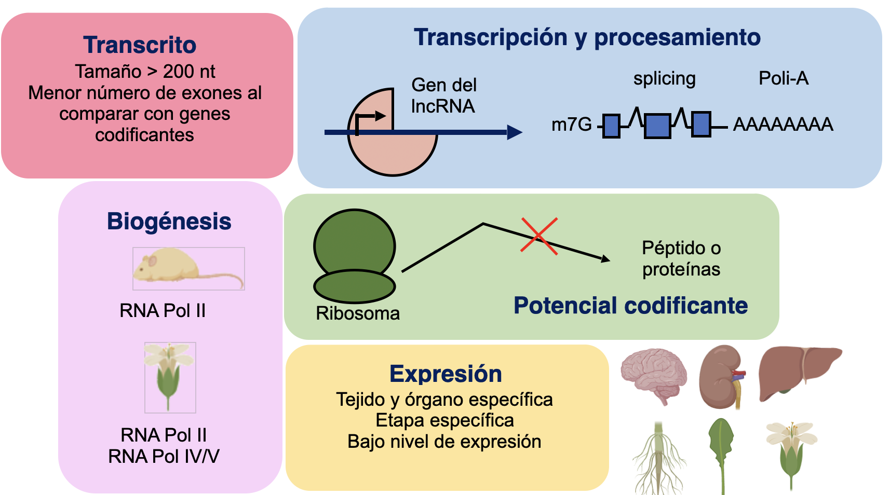
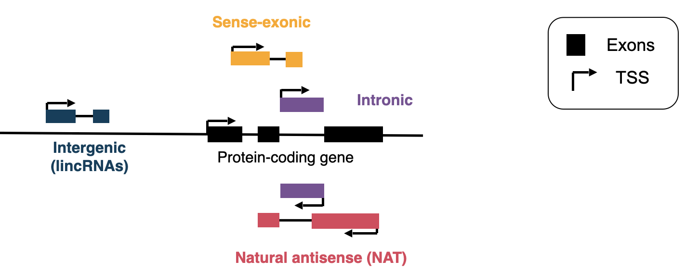

# Exploración y clasificación de lncRNAs

### Introducción didáctica

Los **lncRNAs (long non-coding RNAs o ARN largos no codificantes)** representan una clase diversa de transcritos que no codifican proteínas pero desempeñan funciones clave en la regulación génica. Este capítulo se enfoca en:

-   🔍 **Anotación de nuevos transcritos** a partir de datos de RNA-seq
-   🧠 **Clasificación funcional y estructural de lncRNAs**
-   🛠️ **Ejercicios prácticos en Bash** para identificar y clasificar lncRNAs intergénicos

## Características de los lncRNAs

Los lncRNAs son moléculas de ARN de más de **200 nucleótidos que no codifican proteínas**, pero desempeñan funciones clave en la regulación génica y celular. Aquí tienes un resumen bilingüe y modular de sus características principales:

-   Longitud \>200 nucleótidos
-   **Expresión específica por tejido y etapa:** Se expresan de forma diferencial según el tipo celular, tejido (como el testículo) y etapa del desarrollo
-   **Regulación génica en *cis* y *trans:*** Modulando la expresión de genes vecinos o lejanos.
-   **Diversidad de mecanismos moleculares**

## ¿Cómo clasifican los lncRNAs?

zcat

# Detección de genes codificantes vecinos (neighboring gene pair)

[![Figura 3. Predicción de la función del ARN largo no codificante (lincRNA) basada en la red de coexpresión. Las relaciones de coexpresión entre los genes codificantes (nodos azules) y los genes lincRNA (nodos amarillos) constituyen una red completa. En la subred del módulo, por ejemplo, hay 4 genes lincRNA y 39 genes codificantes, entre los cuales 24 (nodos azul oscuro) tienen la función X y 15 (nodos azul claro) tienen otras funciones. Este módulo está significativamente enriquecido con la función X a través del análisis estadístico. En consecuencia, los cuatro lincRNA de este módulo se predicen como función X. Traducción realizada con la versión gratuita del traductor DeepL.com](img/coexpression.jpeg)](https://academic.oup.com/bib/article/18/5/789/2562763?login=true)

Ejercicio de clasificacion de lncRNAs en humanos

<https://www.gencodegenes.org/human/>

<https://github.com/RegRNALab/Transcriptome-guided_lncRNA_annotation/blob/master/02_Classification_of_lncRNAs_by_categories.md>

Bedtools intersect

<https://bedtools.readthedocs.io/en/latest/content/quick-start.html>

## Material suplementario

-   [Pipeline for lncRNA annotation from RNA-seq data (PLAR)](https://www.weizmann.ac.il/dept/irb/igor-ulitsky/pipeline-lncrna-annotation-rna-seq-data-plar)
-   [lncRNA Identification - P.generosa lncRNAs using CPC2 and bedtools](https://robertslab.github.io/sams-notebook/posts/2023/2023-05-02-lncRNA-Identification---P.generosa-lncRNAs-using-CPC2-and-bedtools/index.html)
-   [RNA-seq Bioinformatics](https://rnabio.org/module-01-inputs/0001/05/01/RNAseq_Data/)
