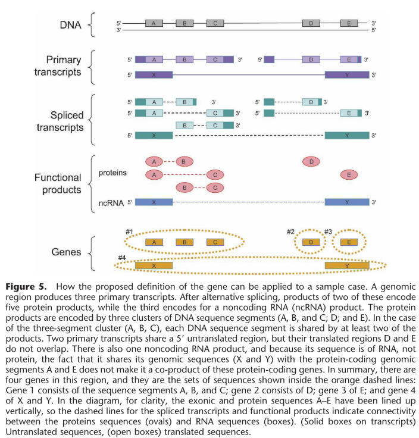
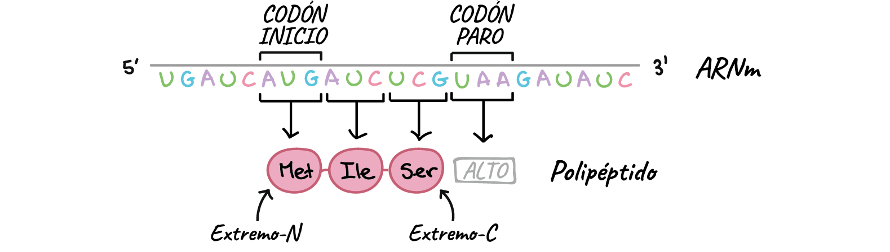
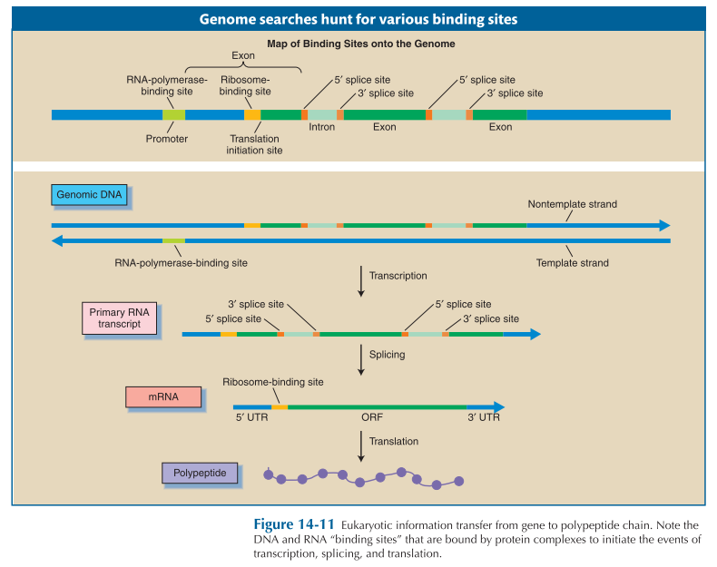
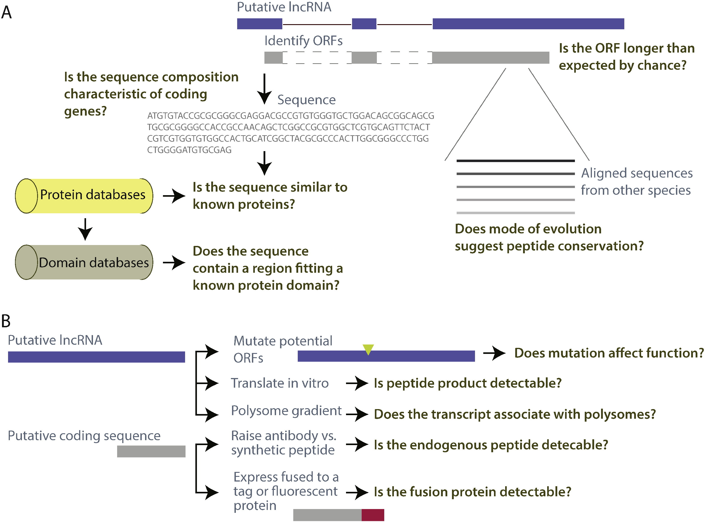
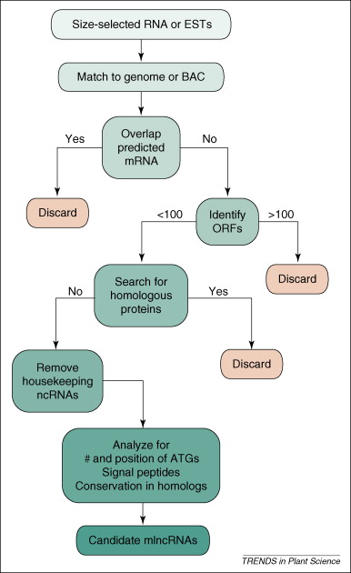
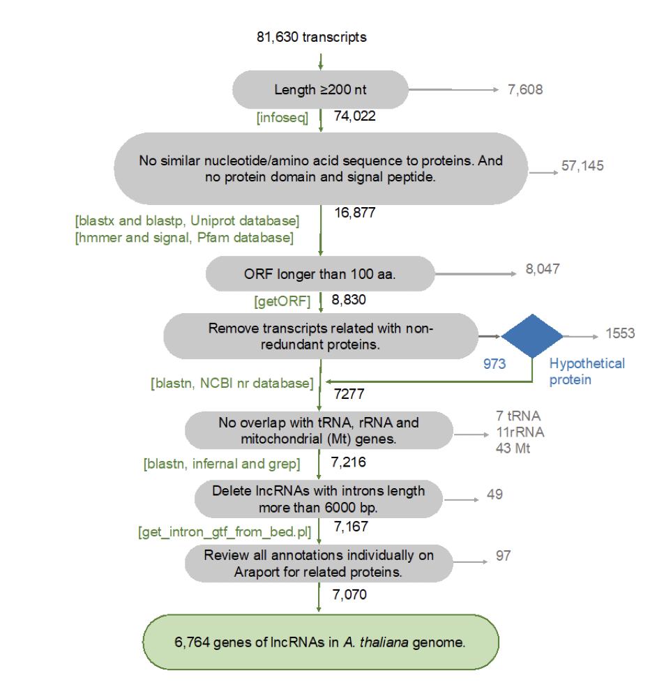

# Definición actualizada y didáctica del gen

::: callout-note
Un **gen** es una unión de secuencias genómicas que codifican un conjunto coherente de productos funcionales potencialmente superpuestos 

> [What is a gene, post-ENCODE? History and updated definition](https://genome.cshlp.org/content/17/6/669.long)
:::

y en casos simples es considerado: un gen es una secuencia de ADN que codifica un producto proteico o de ARN (mRNA o no codificante).



## Potencial codificante

El *potencial codificante* se refiere a la capacidad de una secuencia de ADN o ARN para ser traducida en una proteína funcional. Se evalúa mediante características como la presencia de codones de inicio y parada, la longitud del marco de lectura, la conservación evolutiva y el uso de codones típico de genes.

[](https://es.khanacademy.org/science/ap-biology/gene-expression-and-regulation/translation/a/the-genetic-code-discovery-and-properties)

## Marco de lectura abierto (ORF)

Un *marco de lectura abierto* (ORF) es una secuencia de nucleótidos que comienza con un **codón de inicio (generalmente AUG)** y termina con un **codón de paro (UAA, UAG o UGA)**, sin interrupciones que impidan la traducción. Es una señal estructural que sugiere que la región podría codificar una proteína, aunque no garantiza funcionalidad.



::: callout-note
-   No todos los ORFs son funcionales: algunos pueden ser artefactos o pseudogenes.
-   En transcriptómica y metagenómica, se usan algoritmos para predecir genes basados en ORFs y potencial codificante.
:::

## ¿Cómo distinguimos transcritos codificantes de no codificantes?

La distinción entre transcritos **codificantes** y **no codificantes** es esencial para la anotación funcional del transcriptoma. Aunque los lncRNAs no codifican proteínas, es necesario **descartar evidencia de codificación** antes de clasificarlos como tales.

[](https://www.sciencedirect.com/science/article/pii/S1874939915001728?via%3Dihub)

### Tipos de archivos comunes en bioinformática

+--------------------------------------------------------------------------------------------------------------------------+------------------------------------------------------------------------------------------------------------+-----------------------------------------------------------------------------------------+-----------------------------------------------------------------------+
| Formato                                                                                                                  | Descripción                                                                                                | Empleo                                                                                  | Ejemplo                                                               |
+:========================================================================================================================:+:==========================================================================================================:+:=======================================================================================:+:=====================================================================:+
| [FASTA (`.fasta / .fa`)](https://blast.ncbi.nlm.nih.gov/doc/blast-topics/)                                               | Contiene secuencias de nucleótidos o aminoácidos. Cada entrada inicia con `>` seguido de un identificador. | Genoma de referencia, proteínas, transcriptos/nucleótidos                               | ```                                                                   |
|                                                                                                                          |                                                                                                            |                                                                                         | >seq1                                                                 |
|                                                                                                                          |                                                                                                            |                                                                                         | ATGCGTACGTAGCTAG                                                      |
|                                                                                                                          |                                                                                                            |                                                                                         | ```                                                                   |
+--------------------------------------------------------------------------------------------------------------------------+------------------------------------------------------------------------------------------------------------+-----------------------------------------------------------------------------------------+-----------------------------------------------------------------------+
| [FASTQ (`.fastq`)](https://eveliacoss.github.io/LCG2025_IntroBioinfo_S1/Rnaseq_intro.html#archivos-fastq-fastq.gz-fq.gz) | Similar a FASTA pero incluye calidad de lectura por base (lecturas de secuenciación).                      | esencial en pipelines de secuenciación (RNA-seq, WGS).                                  | ```                                                                   |
|                                                                                                                          |                                                                                                            |                                                                                         | @SEQ_ID                                                               |
|                                                                                                                          |                                                                                                            |                                                                                         | GATTTGGGGTTCAAAGCAGTATCGATCAAATAGTAA                                  |
|                                                                                                                          |                                                                                                            |                                                                                         | +                                                                     |
|                                                                                                                          |                                                                                                            |                                                                                         | !''*((((***+))%%%++)(%%%%).1***-+*''))**                              |
|                                                                                                                          |                                                                                                            |                                                                                         | ```                                                                   |
+--------------------------------------------------------------------------------------------------------------------------+------------------------------------------------------------------------------------------------------------+-----------------------------------------------------------------------------------------+-----------------------------------------------------------------------+
| [GTF/GFF (`.gtf / .gff`)](https://genome.ucsc.edu/FAQ/FAQformat.html#format4)                                            | Archivos de anotación genómica: definen genes, exones, intrones, etc.                                      | clave para anotación estructural y funcional.                                           | ```                                                                   |
|                                                                                                                          |                                                                                                            |                                                                                         | chr1  HAVANA  exon  11869  12227  .  +  .  gene_id "ENSG00000223972"; |
|                                                                                                                          |                                                                                                            |                                                                                         | ```                                                                   |
+--------------------------------------------------------------------------------------------------------------------------+------------------------------------------------------------------------------------------------------------+-----------------------------------------------------------------------------------------+-----------------------------------------------------------------------+
| [BED (`.bed`)](https://genome.ucsc.edu/FAQ/FAQformat.html#format1)                                                       | Define regiones genómicas (intervalos), útil para visualización y análisis de cobertura.                   | Localización de genes, clasificación de genes, visualización (IGV, UCSC Genome Browser) | ```                                                                   |
|                                                                                                                          |                                                                                                            |                                                                                         | chr7  127471196  127472363  region1                                   |
|                                                                                                                          |                                                                                                            |                                                                                         | ```                                                                   |
+--------------------------------------------------------------------------------------------------------------------------+------------------------------------------------------------------------------------------------------------+-----------------------------------------------------------------------------------------+-----------------------------------------------------------------------+

### Herramientas clave en bioinformáticas

[{fig-align="center"}](https://www.sciencedirect.com/science/article/pii/S1360138508001088?via%3Dihub)

::: callout-important
Aquí les dejo el link al [Método de selección](https://github.com/RegRNALab/Transcriptome-guided_lncRNA_annotation/blob/master/01_Strict_Method.md) de lncRNAs empleado en *Arabidopsis thaliana.* Relacionado con el artículo [**Transcriptome-guided annotation and functional classification of long non-coding RNAs in *Arabidopsis thaliana***](https://www.nature.com/articles/s41598-022-18254-0)***.***
:::

+-----------------------------------------------------------------------------------------+-------------------------------------------------------------------------------------------------------+----------------------------------------------------+-----------------------------------------------------------+--------------------------------------------------------------------------------------------------+
| Software                                                                                | Propósito                                                                                             | Función                                            | **Secuencia de interés (input)**                          | Base de datos                                                                                    |
+:=======================================================================================:+:=====================================================================================================:+:==================================================:+:=========================================================:+:================================================================================================:+
| [**`gffread`**](https://github.com/gpertea/gffread)                                     | Obtener el FASTA de las secuencias seleccionadas                                                      | `gffread`                                          | Archivo de anotación (GTF) y genoma de referencia (FASTA) | NA                                                                                               |
+-----------------------------------------------------------------------------------------+-------------------------------------------------------------------------------------------------------+----------------------------------------------------+-----------------------------------------------------------+--------------------------------------------------------------------------------------------------+
| [`EMBOSS/v6.6.0`](http://emboss.sourceforge.net/apps/cvs/emboss/apps/infoseq.html)      | Obtener el tamaño de las secuencias                                                                   | `infoseq`                                          | Secuencias/nucleótidos (FASTA)                            | NA                                                                                               |
+-----------------------------------------------------------------------------------------+-------------------------------------------------------------------------------------------------------+----------------------------------------------------+-----------------------------------------------------------+--------------------------------------------------------------------------------------------------+
| [`kentUtils/v302`](https://github.com/ENCODE-DCC/kentUtils)                             | Extraer la secuencia FASTA a partir de IDs y Generar archivo BED a partir del GTF                     | `faSomeRecords`, `gtfToGenePred` y `genePredToBed` | Secuencias/nucleótidos (FASTA) y IDs.                     | NA                                                                                               |
|                                                                                         |                                                                                                       |                                                    |                                                           |                                                                                                  |
|                                                                                         |                                                                                                       |                                                    | Archivo de anotación (GTF) y genoma de referencia (FASTA) |                                                                                                  |
+-----------------------------------------------------------------------------------------+-------------------------------------------------------------------------------------------------------+----------------------------------------------------+-----------------------------------------------------------+--------------------------------------------------------------------------------------------------+
| [`TransDecoder`](https://github.com/TransDecoder/TransDecoder)                          | Predicción del ORF y la "proteína" codificada                                                         | `TransDecoder.LongOrfs` y `TransDecoder.Predict`   | Secuencias/nucleótidos (FASTA)                            | NA                                                                                               |
+-----------------------------------------------------------------------------------------+-------------------------------------------------------------------------------------------------------+----------------------------------------------------+-----------------------------------------------------------+--------------------------------------------------------------------------------------------------+
| [`blastn`](https://github.com/ncbi/blast_plus_docs)                                     | Comparación con proteínas conocidas                                                                   | `blastn`                                           | proteína (`.pep`)                                         | [UniProtKB/Swiss-Prot](https://www.uniprot.org/help/downloads) (proteínas)                       |
+-----------------------------------------------------------------------------------------+-------------------------------------------------------------------------------------------------------+----------------------------------------------------+-----------------------------------------------------------+--------------------------------------------------------------------------------------------------+
| [`blastp`](https://github.com/ncbi/blast_plus_docs)                                     | Comparación con proteínas conocidas                                                                   | `blastp`                                           | Secuencias/nucleótidos (FASTA)                            | [UniProtKB/Swiss-Prot](https://www.uniprot.org/help/downloads) (nucleótidos)                     |
+-----------------------------------------------------------------------------------------+-------------------------------------------------------------------------------------------------------+----------------------------------------------------+-----------------------------------------------------------+--------------------------------------------------------------------------------------------------+
| [`blastx`](https://github.com/ncbi/blast_plus_docs)                                     | Comparación con proteínas conocidas                                                                   | `blastx`                                           | nucleótidos (traducidos)                                  | [UniProtKB/Swiss-Prot](https://www.uniprot.org/help/downloads) (proteínas)                       |
+-----------------------------------------------------------------------------------------+-------------------------------------------------------------------------------------------------------+----------------------------------------------------+-----------------------------------------------------------+--------------------------------------------------------------------------------------------------+
| [`blastdbcmd`](https://www.ncbi.nlm.nih.gov/books/NBK569853/)                           | Extraer información de la base de datos de BLAST                                                      | `blastdbcmd`                                       | IDs de las secuencias                                     | [RefSeq non-redundant proteins](https://www.ncbi.nlm.nih.gov/refseq/about/nonredundantproteins/) |
+-----------------------------------------------------------------------------------------+-------------------------------------------------------------------------------------------------------+----------------------------------------------------+-----------------------------------------------------------+--------------------------------------------------------------------------------------------------+
| [`SignalP`](https://vcru.wisc.edu/simonlab/bioinformatics/programs/install/signalp.htm) | Predicción de péptidos señal                                                                          | `signalp`                                          | proteína                                                  | NA                                                                                               |
+-----------------------------------------------------------------------------------------+-------------------------------------------------------------------------------------------------------+----------------------------------------------------+-----------------------------------------------------------+--------------------------------------------------------------------------------------------------+
| [`TMHMM`](https://services.healthtech.dtu.dk/services/TMHMM-2.0/)                       | Predicción de dominios transmembranales                                                               | `tmhmm`                                            | proteína                                                  | NA                                                                                               |
+-----------------------------------------------------------------------------------------+-------------------------------------------------------------------------------------------------------+----------------------------------------------------+-----------------------------------------------------------+--------------------------------------------------------------------------------------------------+
| [`Phobius`](https://phobius.sbc.su.se/)                                                 | Predicción de dominios transmembranales y péptidos señal                                              | `phobius.pl`                                       | proteína                                                  | NA                                                                                               |
+-----------------------------------------------------------------------------------------+-------------------------------------------------------------------------------------------------------+----------------------------------------------------+-----------------------------------------------------------+--------------------------------------------------------------------------------------------------+
| [`HMMER`](https://www.howtoinstall.me/ubuntu/18-04/hmmer/)                              | Búsqueda de dominios conservados                                                                      | `hmmscan`                                          | proteína                                                  | [Pfam](http://pfam.xfam.org/)                                                                    |
+-----------------------------------------------------------------------------------------+-------------------------------------------------------------------------------------------------------+----------------------------------------------------+-----------------------------------------------------------+--------------------------------------------------------------------------------------------------+
| [`Infernal`](http://eddylab.org/infernal/)                                              | Busca coincidencias estructurales en secuencias usando modelos de covarianza y escanea bases de datos | `cmsearch`                                         | Secuencias/nucleótidos (FASTA)                            | [Rfam](https://rfam.org/)                                                                        |
+-----------------------------------------------------------------------------------------+-------------------------------------------------------------------------------------------------------+----------------------------------------------------+-----------------------------------------------------------+--------------------------------------------------------------------------------------------------+

{fig-align="center" width="611"}

::: callout-note
-   Si el transcrito **no tiene similitud con proteínas conocidas**, **no contiene péptido señal**, **no tiene dominios transmembranales**, y **no presenta dominios conservados**, es **probablemente no codificante**.

-   Si alguno de estos elementos está presente, se debe considerar como **potencialmente codificante** y excluirlo de la clasificación como **no codificante**.
:::

## Material suplementario

-   Curso del Dr. Cei Abreu - [BLAST en la línea de comando](http://datos.langebio.cinvestav.mx/~cei/cursos/BioinfoBP/sesion03.html)
-   [Pipeline for lncRNA annotation from RNA-seq data (PLAR)](https://www.weizmann.ac.il/dept/irb/igor-ulitsky/pipeline-lncrna-annotation-rna-seq-data-plar)
-   [lncRNA Identification - P.generosa lncRNAs using CPC2 and bedtools](https://robertslab.github.io/sams-notebook/posts/2023/2023-05-02-lncRNA-Identification---P.generosa-lncRNAs-using-CPC2-and-bedtools/index.html)
-   [RNA-seq Bioinformatics](https://rnabio.org/module-01-inputs/0001/05/01/RNAseq_Data/)
