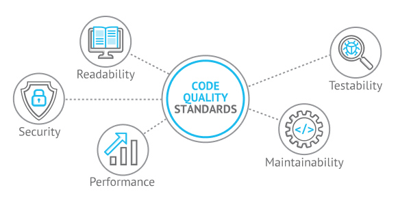
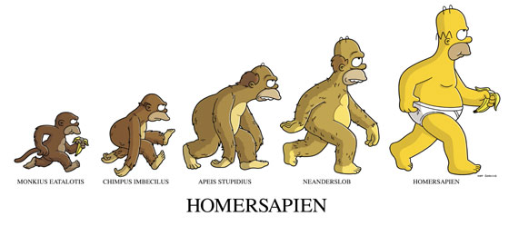
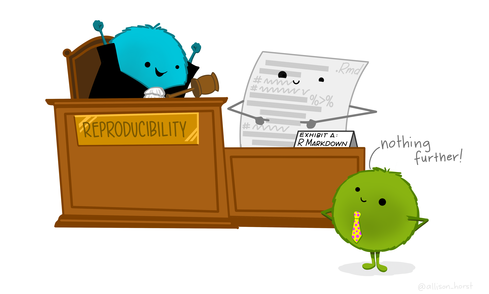
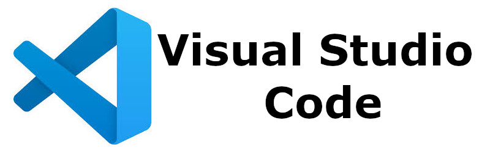
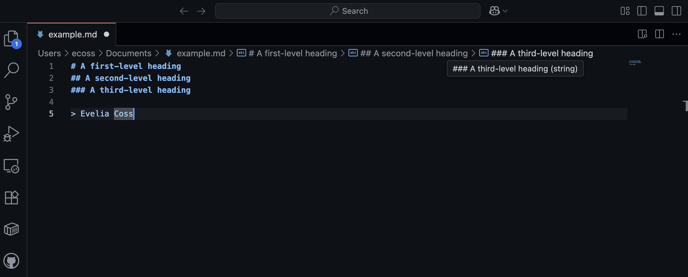
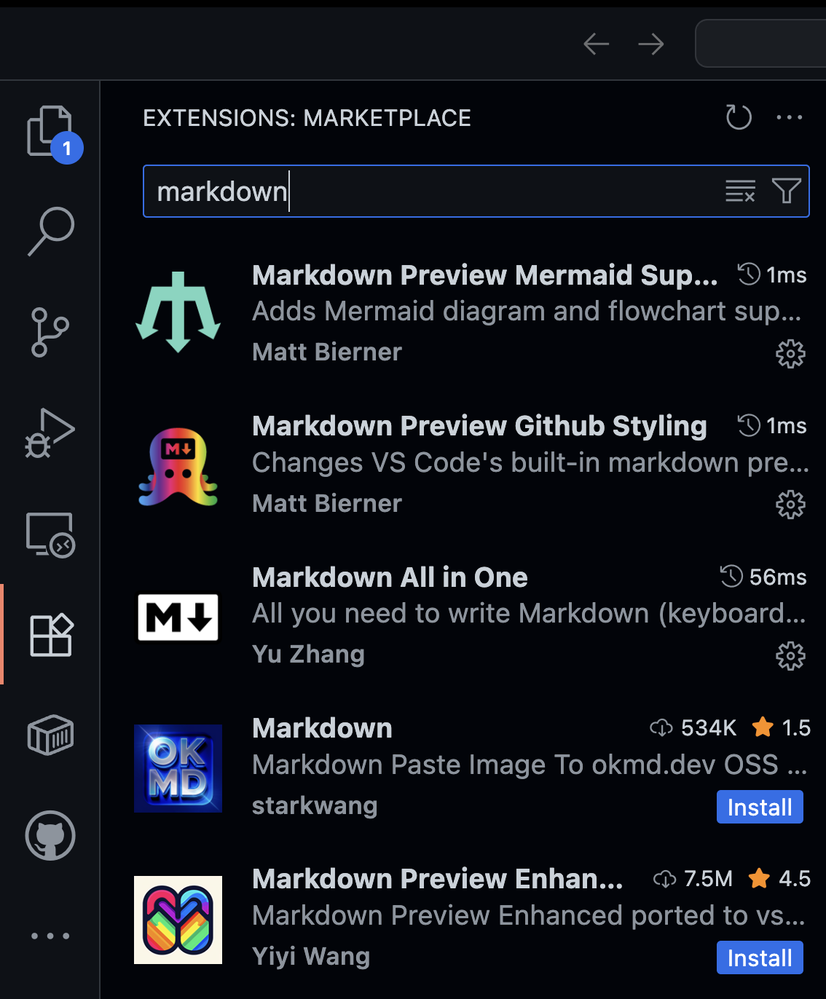
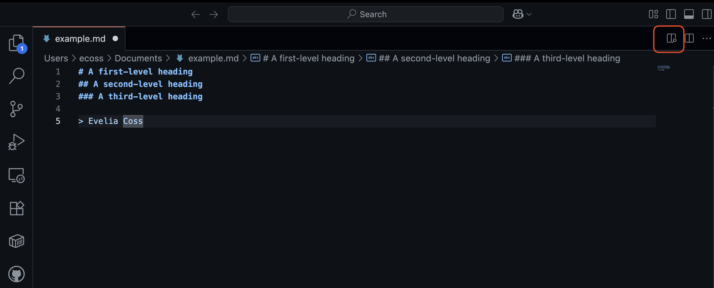
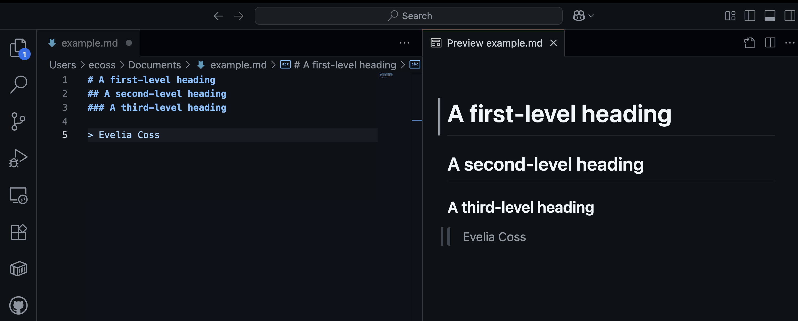

```{r setup, include = FALSE}
# Setup chunk
# Paquetes a usar
#options(htmltools.dir.version = FALSE) cambia la forma de incluir código, los colores

library(knitr)
library(tidyverse)
library(xaringanExtra)
library(icons)
library(fontawesome)
library(emo)
library(countdown) # remotes::install_github("gadenbuie/countdown", subdir = "r"), Explicacion de su uso: https://pkg.garrickadenbuie.com/countdown/#5

# set default options
opts_chunk$set(collapse = TRUE,
               dpi = 300,
               warning = FALSE,
               error = FALSE,
               comment = "#")

top_icon = function(x) {
  icons::icon_style(
    icons::fontawesome(x),
    position = "fixed", top = 10, right = 10
  )
}

knit_engines$set("yaml", "markdown")

# Con la tecla "O" permite ver todas las diapositivas
xaringanExtra::use_tile_view()
# Agrega el boton de copiar los códigos de los chunks
xaringanExtra::use_clipboard()

# Crea paneles impresionantes 
xaringanExtra::use_panelset()

# Para compartir e incrustar en otro sitio web
xaringanExtra::use_share_again()
xaringanExtra::style_share_again(
  share_buttons = c("twitter", "linkedin")
)

# Funcionalidades de los chunks, pone un triangulito junto a la línea que se señala
xaringanExtra::use_extra_styles(
  hover_code_line = TRUE,         #<<
  mute_unhighlighted_code = TRUE  #<<
)

# Agregar web cam
xaringanExtra::use_webcam()

# barra de progreso
xaringanExtra::use_progress_bar(color = "#0051BA", location = "top", height = "10px")
```

```{r xaringan-editable, echo=FALSE}
# Para tener opciones para hacer editable algun chunk
xaringanExtra::use_editable(expires = 1)
# Para hacer que aparezca el lápiz y goma
xaringanExtra::use_scribble()
```

```{r xaringan-themer Eve, include=FALSE, warning=FALSE}
# Establecer colores para el tema
library(xaringanthemer)

palette <- c(
 orange        = "#fb5607",
 pink          = "#ff006e",
 blue_violet   = "#8338ec",
 zomp          = "#38A88E",
 shadow        = "#87826E",
 blue          = "#1381B0",
 yellow_orange = "#FF961C"
  )

#style_xaringan(
style_duo_accent(
  background_color = "#FFFFFF", # color del fondo
  link_color = "#562457", # color de los links
  text_bold_color = "#0072CE",
  primary_color = "#01002B", # Color 1
  secondary_color = "#CB6CE6", # Color 2
  inverse_background_color = "#00B7FF", # Color de fondo secundario 
  colors = palette,
  
  # Tipos de letra
  header_font_google = google_font("Barlow Condensed", "600"), #titulo
  text_font_google   = google_font("Work Sans", "300", "300i"), #texto
  code_font_google   = google_font("IBM Plex Mono") #codigo
  #text_font_size = "1.5rem" # Tamano de letra
)

# https://www.rdocumentation.org/packages/xaringanthemer/versions/0.3.4/topics/style_duo_accent
```

class: title-slide, middle, center
background-image: url(figures/Clases_Rladies_Slide1_reproducible.png) 
background-position: 90% 75%, 75% 75%, center
background-size: 1210px,210px, cover


.center-column[
# `r rmarkdown::metadata$title`
### `r rmarkdown::metadata$subtitle`

####`r rmarkdown::metadata$author` 
#### `r rmarkdown::metadata$date`
]

.left[.footnote[R-Ladies Theme[R-Ladies Theme](https://www.apreshill.com/project/rladies-xaringan/)]]

---
background-image: url(figures/liigh_unam_logo.png) 
background-position: 10% 10%
background-size: 10%
class: middle, center


# Sobre mi
----

.left-col[

### `r fontawesome::fa("dna", fill = "#181818")` Dra. Evelia Lorena Coss-Navarrete

Investigadora Posdoctoral en el Laboratorio Internacional de Investigación sobre el Genoma Humano [(LIIGH), UNAM](https://twitter.com/LIIGH_UNAM), campus Juriquilla


[`r fontawesome::fa("link")` Dra Alejandra Medina-Rivera](https://liigh.unam.mx/profile/dra-alejandra-medina-rivera/)

[`r fontawesome::fa("github")` EveliaCoss.github.io](https://eveliacoss.github.io/)

]


.center-col[


### `r fontawesome::fa("star", fill = "#181818")` Miembro

- [LupusRGMX](https://twitter.com/LupusRgmx)
- [Proyecto JAGUAR](https://twitter.com/PJaguarLATAM)
- [Rladies Morelia](https://www.facebook.com/profile.php?id=100093337606435)
- [CDSB - Mexico](https://twitter.com/CDSBMexico)
- [RIABIO](https://twitter.com/RiaBioNet)
- [The Carpentries](https://carpentries.org/index.html)
- [ISCB-RSG Mexico](https://rsg-mexico.iscbsc.org/)
- [ISCB Wikipedia team](https://x.com/iscbwikiteam)
]


.right-col[

### `r fontawesome::fa("circle-nodes", fill = "#181818")` Formación académica

- Doctorado en Biotecnología de Plantas, [Cinvestav, Langebio](https://twitter.com/uga_langebio),  [`r fontawesome::fa("link")` Dra Selene Fernandez-Valverde](https://twitter.com/SelFdz)
- Maestría en Biotecnología de Plantas, [Cinvestav, Unidad Irapuato](https://twitter.com/CinvestavIra)
- Ing. en Biotecnología, [UPSIN](https://www.facebook.com/UPSINSINALOA)

]

---
class: inverse, center, middle

`r fontawesome::fa("laptop-file", height = "3em")`
# Buenas prácticas en Bioinformática
---

## Un algoritmo nos permite resolver un problema ⭐

Un algoritmo es un método para resolver un problema mediante una serie de pasos **definidos, precisos y finitos.**

- **Definido:** si se sigue dos veces, se obtiene el mismo resultado. Es reproducible.
- **Preciso:** implica el orden de realización de cada uno de los pasos.
- **Finito:** Tiene un numero determinado de pasos, implica que tiene un fin.

> Un algoritmo podemos definirlo como un **programa o software.**

```{r, echo=FALSE, out.width='60%', fig.align='center'}
knitr::include_graphics("figures/allison-horst-code-kitchen.png")
```
.left[.footnote[.black[
Imagen tomada de: [Allison Horst](https://allisonhorst.com/allison-horst) 
]]]

---

## Para escribir un buen software necesitas:

> Escribir código mantenible (maintainable code), usar control de versiones (version control) y rastreadores de problemas (issue trackers), revisiones de código (code reviews), pruebas unitarias (unit testing) y automatización de tareas (task automation).
>
> [Wilson, *et al.* 2014. *PLOS Biology*](https://journals.plos.org/plosbiology/article?id=10.1371/journal.pbio.1001745)

```{r, echo=FALSE, out.width='60%', fig.align='center'}

```
.left[.footnote[.black[
Imagen tomada de: https://devcom.com/tech-blog/code-quality-definition-how-to-improve-code-quality/
]]]

---

## Pasos para escribir un buen software

.pull-left[
1. Análisis del problema / Definir el problema

2. Diseño del algoritmo / Diseño del programa

3. Codificación / Escribir el código

4. Compilación y ejecución del programa

5. Verificación / Realizar pruebas

6. Depuración / Detectar los errores y corregirlos
> Programacion defensiva

7. Documentación
]

.pull-right[

```{r, echo=FALSE, out.width='80%', fig.align='center'}

```
]

---

## Paso 7: Documentación

```{r, echo=FALSE, out.width='80%', fig.align='center'}

```

.left[.footnote[.black[
Imagen tomada de: [Allison Horst](https://allisonhorst.com/allison-horst) 
]]]

---

## Correcta documentación de nuestro código

.content-box-blue[

- **Título:** (opcional)

- **Autor (author):** Su nombre

- **Dia (date):** Fecha de creación

- **Paquetes** (packages)

- **Directorio de trabajo (Working directory):** En que carpeta se encuentra tu datos y programa.

- **Información descriptiva del programa (Description):** ¿Para qué sirve el programa? Ej: El siguiente programa realiza la suma de dos números enteros a partir de la entrada del usuario y posteriormente la imprime en pantalla.

- **Usage ¿Cómo se utiliza?**

- **Argumentos (Arguments)**

  + Información de entrada (Data Inputs): Ej: Solo números enteros (sin decimales).

  + Información de salida (Outpus): Gráficas, figuras, tablas, etc.

]

---

```{r, echo=FALSE, out.width='40%', fig.align='center'}

```

---

## Puntos claves para buenas practicas en bioinfo ⭐

1. Escriba **programas para personas, no para computadoras** (Documenta qué hace y por qué). - Se coherente en la nomenclatura, indentación y otros aspectos del estilo.

2. Divide los programas en funciones cortas de un solo propósito. 💻 📚

3. **No repitas tu código.** Crea pasos reproducibles o que se repitan por si solas. ➰

4. Planifique los errores (**Programacion defensiva**) 🚩

5. Optimice el software sólo después de que funcione correctamente. - Si funciona no lo modifiques, simplificalo.

6. Colaborar - Busque siempre bibliotecas de software bien mantenidas que hagan lo que necesita. 👥


> Ejemplo de como realizo mis documentos 💜
> Aqui les dejo el script que les doy a mis alumnos [VisualizacionDatos.R](https://github.com/EveliaCoss/RNAseq_classFEB2024/blob/main/Practica_Dia3/scripts/VisualizacionDatos.R) del curso de [Análisis de datos de RNA-Seq](https://github.com/EveliaCoss/RNAseq_classFEB2024).

---

## Código reproducible 🌟

.pull-left[
### Contenedores ⚡

.pull-left[
- [Docker](https://docs.docker.com/) 
- [Singularity](https://docs.sylabs.io/guides/3.5/user-guide/introduction.html)
- [Apptainer](https://apptainer.org/)
]

.pull-right[
```{r, echo=FALSE, out.width='50%', fig.align='right'}

```
]

Se puede almacenar todo el workflow, archivos, generando código reproducible y cooperativo.

> Minicurso del uso de [Docker](https://www.melbournebioinformatics.org.au/tutorials/tutorials/docker/docker/).

]

.pull-right[

.pull-left[
### Crear pipelines completos 🌀

- [Nextflow](https://training.nextflow.io/es/) 
- [Snakemake](https://snakemake.readthedocs.io/en/stable/tutorial/tutorial.html)
]

.pull-right[
```{r, echo=FALSE, out.width='80%', fig.align='right'}
knitr::include_graphics("figures/nf-core-logo.png")
```
] 

.content-box-gray[
Curso de Nextflow en los [VieRnes de Bioinformática (2024)](https://github.com/EveliaCoss/ViernesBioinfo2024#viernes-22-23-y-24-nextflow) con el Dr. Israel Aguilar.
]

]

---

## Repositorios digitales abiertos

Contar con repositorios digitales de acceso **abierto** diseñado para **almacenar, compartir y preservar productos** de investigación científica.

.panelset[
.panel[.panel-name[Repositorios académicos y científicos]

| Página web    | Descripción breve                                                             |
|---------------|-------------------------------------------------------------------------------|
| [Figshare](https://figshare.com/) | Ideal para compartir datasets, figuras, presentaciones y multimedia con DOI.       |
| [bioRxiv](https://www.biorxiv.org/) / [medRxiv](https://www.medrxiv.org/)  | Preprints en biología y medicina, respectivamente.                       |

]

.panel[.panel-name[Repositorios de software y código]

| Repositorio   |  Enfoque principal                                                            |
|---------------|-------------------------------------------------------------------------------|
| [GitHub](https://github.com/)        | Desarrollo colaborativo de software, documentación y automatización.          |
| [GitLab](https://about.gitlab.com/gitlab-duo/agent-platform/)        | Similar a GitHub, con más control sobre privacidad y CI/CD integrado.         |
| [Bitbucket](https://bitbucket.org/product/)     | Integración con Jira y herramientas ágiles, útil para equipos técnicos.       |
| [Zenodo](https://zenodo.org/)      | Publicación de software, datasets y documentación con DOI; integración directa con GitHub para versionado y citación reproducible. Ideal para proyectos científicos y educativos.  |

]
]


---

## Datos en investigación

Como científico puedes:

- **Crear datos.** Resultado de tus experimentos, de muestreos, de curación de datos, etc.
- **Usar datos de terceros.** Puedes a partir de éstos datos, analizarlos y descubrir nuevo conocimiento.
  + **Datos primarios o sin procesar:** Datos originales que han sido recolectados pero aún no han sido procesados o analizados. Algunos ejemplos son los registros sonoros, observaciones, notas de campo o datos de experimentos.
  + **Datos procesados:** Datos que han sido digitalizados, traducidos, transcritos, limpiados, validados y verificados.
  + **Datos analizados:** Modelos, gráficos, tablas, textos u otros, que han sido creados a partir de los datos primarios y procesados, y que se pretende sean de ayuda en el descubrimiento de información útil, la presentación de conclusiones y la toma de decisiones.

https://biblioguias.cepal.org/gestion-de-datos-de-investigacion/tipos-datos

Diapo de https://lcg-cursos.github.io/material/introbioinfo/L2-buenas-practicas.html#22

---
class: inverse, center, middle

`r fontawesome::fa("laptop-file", height = "3em")`
# Zenodo

---

## Zenodo

### 🔍 ¿Para qué sirve Zenodo?

- **Publicar artículos, datasets, software y más:** Puedes subir desde papers y conjuntos de datos hasta scripts, presentaciones y materiales didácticos.
- **Asignar DOI automáticamente:** Cada archivo recibe un identificador digital persistente (DOI), lo que facilita su citación y trazabilidad.
- **Cumplir con políticas de ciencia abierta:** Ideal para proyectos financiados por organismos que exigen acceso abierto.
- **Crear comunidades temáticas:** Puedes agrupar tus publicaciones en colecciones colaborativas.
- **Versionado y licencias:** Permite subir nuevas versiones de un mismo trabajo y elegir licencias como CC BY 4.0.


.content-box-gray[
**Ejemplo práctico:** Si estás desarrollando un paquete en R, puedes subir el código, documentación, ejemplos y datasets a Zenodo. Al vincularlo con GitHub, incluso puedes generar un DOI para cada release del repositorio.

- Paquete [palmerpenguins](https://allisonhorst.github.io/palmerpenguins/articles/intro.html), 
- Zenodo del paquete: [allisonhorst/palmerpenguins: v0.1.0](https://zenodo.org/records/3960218)
- Zenodo de los datos: [datos de palmerpenguins](https://zenodo.org/records/14902740)

]


---

GitHub

---


---
class: inverse, center, middle

`r fontawesome::fa("laptop-file", height = "3em")`
# ¿Qué es Markdown?
---

## ¿Qué es Markdown?

Markdown es un **lenguaje de marcado ligero** que permite añadir elementos de formato a documentos de *texto plano*. Creado por John Gruber en 2004, Markdown es actualmente uno de los lenguajes más populares del mundo.

- Sencillo y legible, sin necesidad de usar editores complicados o HTML.
- **lenguaje de marcado ligero:** Escribir texto que incluye instrucciones simples para darle formato.

--

### 🧩 ¿Por qué se llama “ligero”?

Porque:

- Usa símbolos sencillos como `*, #,` o `-` para indicar formato.
- No requiere cerrar etiquetas como `<strong> o <div>` (como en HTML).
- Es minimalista y limpio, ideal para escribir rápido sin distracciones.

---

## 🧠 ¿Para qué se usa?

- Crear documentación técnica o científica
- Escribir **README.md** en proyectos de GitHub
- Generar contenido para sitios web
- Crear [tesis](https://quarto.org/docs/get-started/hello/rstudio.html), notas, [libros](https://bookdown.org/yihui/rmarkdown-cookbook/), [presentaciones](https://bookdown.org/yihui/rmarkdown/xaringan.html) y posters

.panelset[
.panel[.panel-name[En R]

| Paquete / Programa     | Uso principal                                                                 |
|------------------------|-------------------------------------------------------------------------------|
| `rmarkdown`            | Crear documentos reproducibles con texto, código y resultados                |
| `knitr`                | Ejecutar chunks de código en RMarkdown                                       |
| `Quarto`               | Plataforma moderna para documentos con R, Python, etc.                       |
| `bookdown`             | Crear libros técnicos con Markdown + RMarkdown                               |
| `blogdown`             | Generar blogs científicos usando Markdown y Hugo                             |
| `flexdashboard`        | Dashboards interactivos escritos en Markdown                                 |


]

.panel[.panel-name[En Python]

| Paquete / Programa     | Uso principal                                                                 |
|------------------------|-------------------------------------------------------------------------------|
| Jupyter Notebooks      | Celdas Markdown para explicar y documentar junto con código                  |
| `Quarto`               | Igual que en R, permite combinar Markdown con código Python                  |
| `mkdocs`               | Generar sitios web de documentación técnica desde archivos Markdown          |
| `Sphinx + MyST`        | Documentación avanzada con soporte para Markdown                             |
| `markdown`, `mistune`  | Librerías para convertir Markdown a HTML                                     |
| `nbconvert`            | Exportar notebooks con Markdown a PDF, HTML, LaTeX, etc.                     |

]
]


---

## ¿Cómo funciona?

Pasos generales: 

1. Crear un archivo Markdown con un editor de texto o una aplicación específica. El archivo debe tener la extensión `.md o .markdown`.
2. Se abre el archivo Markdown en una aplicación Markdown.
3. Se utiliza la aplicación Markdown para convertir el archivo Markdown en un documento HTML.
4. Visualización del archivo HTML en un navegador web o use la aplicación Markdown para convertirlo a otro formato de archivo, como PDF.


.content-box-gray[
La aplicación y el procesador de Markdown son dos componentes independientes. Para simplificar, los he combinado en un solo elemento ("aplicación de Markdown") en la figura a continuación.
]

```{r, echo=FALSE, out.width='60%', fig.align='center'}
knitr::include_graphics("figures/markdown-flowchart.png")
```

.left[.footnote[.black[
Imagen tomada de: https://www.markdownguide.org/getting-started/
]]]

---

## Markdown app: Visual Studio Code

**Visual Studio Code** es un editor de código que combina las funcionalidades de un entorno de desarrollo integrado (IDE) con la simplicidad de un editor de texto. 


.pull-left[

#### ¿Por qué se usa?

- **VS Code** es gratuito y de código abierto
- Multiplataforma (Windows, macOS y Linux)
- Control de versiones integrado
- Amplia gama de extensiones

```{r, echo=FALSE, out.width='80%', fig.align='center'}

```

]


.pull-right[

#### La interfaz de usuario

Al iniciar **VS Code** por primera vez encontraremos interfaz limpia y minimalista. Aunque pueda parecer simple a primera vista, la interfaz de VS Code es extremadamente poderosa y personalizable.

```{r, echo=FALSE, out.width='100%', fig.align='center'}

```

]


---


Vamos a instalarlo de acuerdo a [nuestra plataforma](https://code.visualstudio.com/).

---

## Vamos a instalar unas extensiones

Las extensiones de **VS Code** son complementos que puedes instalar para ampliar las funciones del editor según tus necesidades. Son como piezas de LEGO 🧱 que personalizan tu entorno de desarrollo, desde el lenguaje que usas hasta el estilo visual y herramientas de productividad.

```{r, echo=FALSE, out.width='100%', fig.align='center'}

```

---

## Lenguaje de programación Markdown

Vamos a ver como se realiza la Sintaxis de escritura y formatos básicos empleados en Markdown:

- [Documentación de GitHub](https://docs.github.com/es/get-started/writing-on-github/getting-started-with-writing-and-formatting-on-github/basic-writing-and-formatting-syntax) 
- [Rmarkdown](https://github.com/EveliaCoss/RmarkdownGraphs_notes)


---

```{r, echo=FALSE, out.width='100%', fig.align='center'}

```

---

```{r, echo=FALSE, out.width='100%', fig.align='center'}

```

---

Como parte de tu repositorio EveliaCoss/README.md, quiero que escribas un miniresumen de tus gustos e intereses personales. Este archivo será tu carta de presentación en GitHub, así que enfócate en mostrar quién eres de forma auténtica y profesional.

🧠 Instrucciones:

Crea o edita el archivo README.md dentro del repositorio EveliaCoss.

Escribe entre 5 y 10 líneas sobre ti. Puedes incluir:

Tus intereses académicos o profesionales

Hobbies o actividades que disfrutas

Qué te motiva a aprender programación, ciencia o bioinformática

Algún dato curioso o divertido sobre ti

🎯 Objetivo: Practicar la escritura clara y personal en Markdown, y comenzar a construir tu identidad digital como estudiante y colaborador/a en ciencia abierta.

💡 Tip: Usa frases breves, evita copiar de otros perfiles, y escribe como si te presentaras ante una comunidad científica que quiere conocerte.


---

class: center, middle

`r fontawesome::fa("code", height = "3em")`
# Fin

Gracias por tu atención, respira y coméntame tus dudas. 


